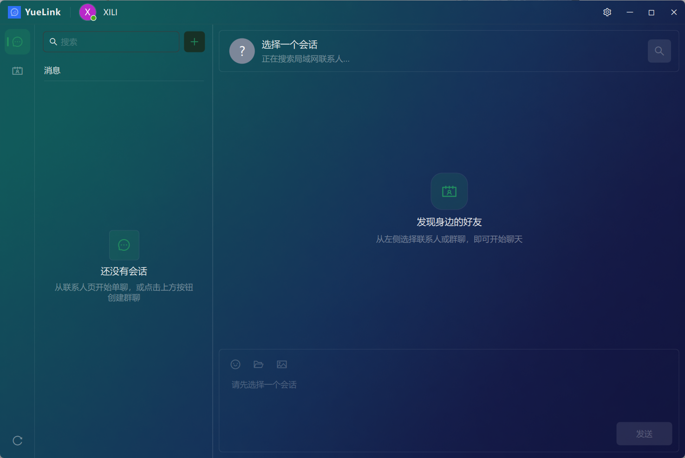
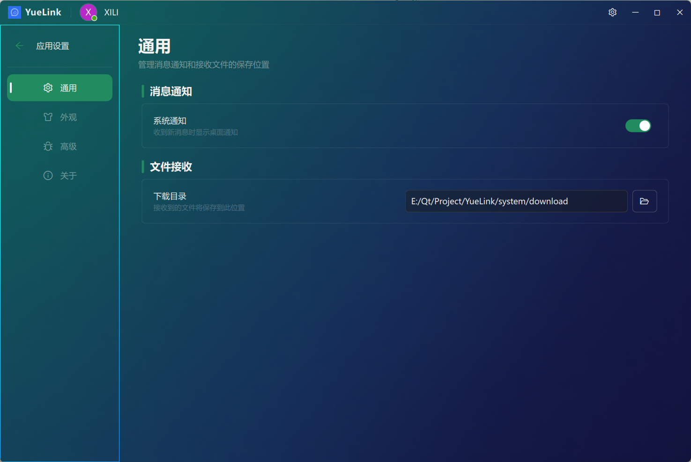
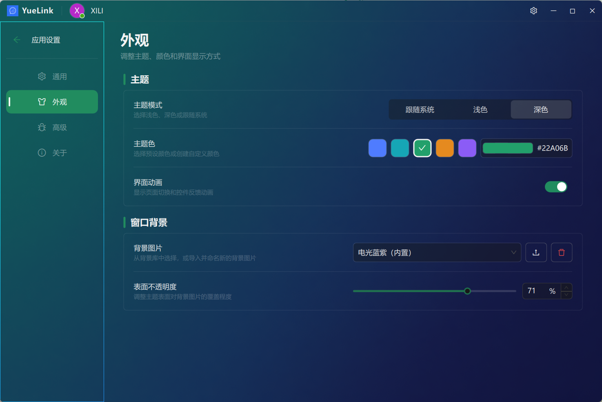
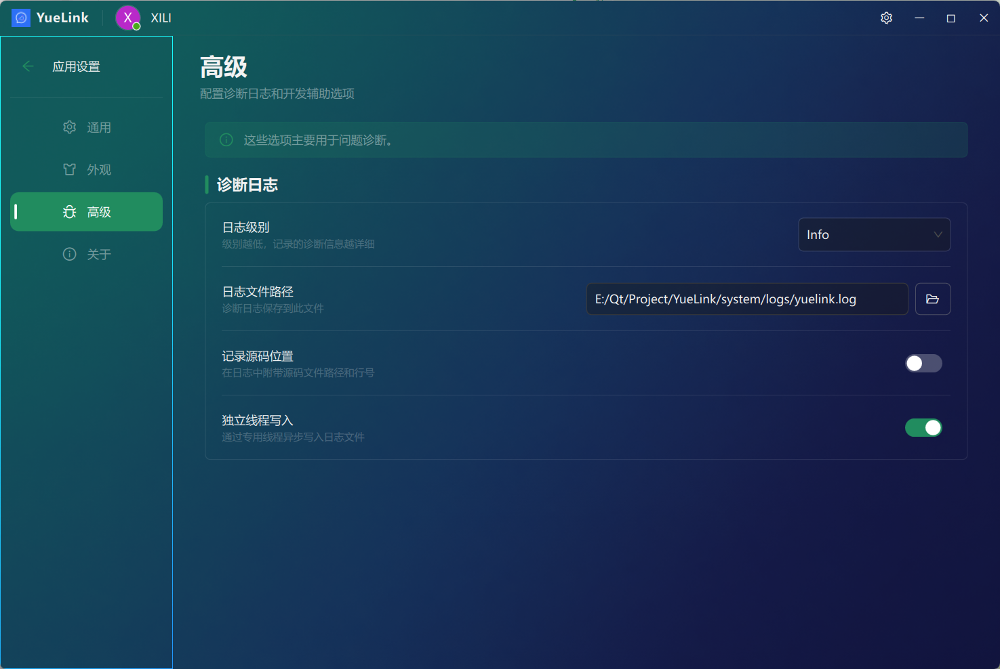
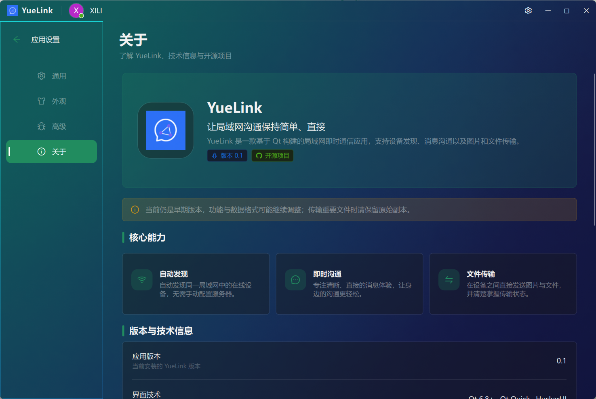

<p align="center">
  
</p>

<h1 align="center">YueLink</h1>

<p align="center">
  让局域网沟通保持简单、直接
</p>

<p align="center">
  
  
  
  
</p>

YueLink 是一款基于 Qt 6、Qt Quick 与 HuskarUI 构建的局域网即时通信应用。它通过 UDP 自动发现同一网络中的设备，并使用 TCP 完成消息和文件传输，无需部署中心服务器。

> YueLink 当前仍处于早期开发阶段，功能、通信协议与数据格式可能继续调整。传输重要文件时，请保留原始副本。

## 应用预览

### 主界面

YueLink 将导航、会话列表与聊天区域集中在同一个桌面窗口中。应用会自动发现局域网联系人，可从联系人页发起单聊或创建群聊，并在会话中发送文本、图片和文件。



### 通用设置

通用设置用于管理桌面消息通知，以及接收文件的默认保存目录。



### 外观设置

支持浅色、深色和跟随系统三种主题模式，可调整主题色、界面动画、窗口背景图片及表面不透明度。背景库支持导入本地图片并为其命名。



### 高级设置

高级设置提供诊断日志级别、日志文件位置、源码位置记录和独立线程写入等选项，便于定位运行问题。



### 关于页面

关于页面集中展示应用版本、核心能力、技术信息、第三方开源项目以及源码与问题反馈入口。



## 主要功能

- 自动发现：通过 UDP 发现同一局域网中的在线设备。
- 即时通信：支持联系人单聊与多人群聊。
- 多种消息：支持文本、Emoji、图片和普通文件。
- 文件传输：支持接收确认、取消、打开文件和定位文件。
- 本地历史：使用 SQLite 保存会话、群组和消息记录。
- 桌面通知：应用不在前台时可显示新消息通知。
- 个性化外观：支持主题模式、主题色、动画、背景图和透明度配置。
- 诊断能力：提供可配置的日志级别、文件位置与异步写入选项。

## 使用方式

1. 确保参与通信的设备位于同一局域网。
2. 在各设备上启动 YueLink，并允许系统防火墙放行局域网通信。
3. 等待应用自动发现在线联系人，或使用左下角按钮重新发起发现。
4. 在联系人页选择好友发起单聊，或通过顶部按钮创建群聊。
5. 进入会话后发送文字、表情、图片或文件。

## 构建要求

- CMake 3.16 或更高版本
- 支持 C++17 的编译器
- Qt 6.8 或更高版本，包含以下模块：
  - Core
  - Network
  - Sql
  - Quick
  - QuickControls2
  - Widgets
- [HuskarUI v0.6.1](https://github.com/mengps/HuskarUI)

HuskarUI、QyLog 与 nlohmann/json 均通过 Git submodule 管理，无需单独安装这些依赖。

## 构建项目

克隆仓库：

```bash
git clone --recurse-submodules https://github.com/B00KS1Y1/YueLink.git
cd YueLink
```

已有仓库可执行 `git submodule update --init --recursive` 初始化第三方 submodule。

配置并构建：

```bash
cmake -S . -B build -DCMAKE_PREFIX_PATH="<Qt 安装前缀>"
cmake --build build --config Release
```

HuskarUI 会随项目一同配置；可执行文件会生成在构建目录的 `bin` 路径或对应配置子目录中。

## 项目架构

```text
domain/                             # 领域类型与端口接口
application/                        # 聊天用例、状态编排与文件传输协调
config/                             # JSON 配置模型、校验与读写
infrastructure/                     # 网络、SQLite、日志和运行时实现
YueLink/                            # QML 界面、桌面适配与程序入口
├── assets/                         # 应用图标、背景与 Emoji 资源
├── qml/                            # Qt Quick / HuskarUI 界面
└── settings/                       # 暴露给 QML 的设置模型
```

主要 CMake 目标：

- `YueLink`：Qt Quick 与 HuskarUI 图形界面。
- `YueLinkDomain`：领域类型和抽象接口。
- `YueLinkApplication`：应用用例与状态协调。
- `YueLinkRuntime`：配置、日志、路径和运行时初始化。
- `YueLinkNetwork`：局域网发现、消息与文件传输。
- `YueLinkPersistence`：SQLite 会话仓储。

领域层不依赖任何具体实现；应用层依赖领域抽象，网络、持久化与表现层在外层完成实现和装配。`ChatCoordinator` 负责应用生命周期与聊天用例，`ConversationStore` 管理会话状态和持久化，`TransferCoordinator` 管理文件传输状态机。

## 运行时数据

YueLink 默认在应用数据根目录创建以下内容：

```text
system/
├── configs/                        # 应用、主题、日志和身份配置
├── database/                       # SQLite 数据库、WAL 与 SHM 文件
└── logs/                           # yuelink.log 及轮转日志
```

Debug 构建的 JSON 配置默认保存在项目根目录的 `system/configs`；Release、RelWithDebInfo 和 MinSizeRel 构建默认保存在可执行文件目录的 `system/configs`。

接收文件默认保存到系统下载目录中的 `YueLink` 文件夹，也可以在通用设置中选择其他绝对路径。

可在启动前通过以下环境变量覆盖部分运行时目录：

- `YUELINK_SYSTEM_DIR`：`system` 根目录。
- `YUELINK_LOG_DIR`：日志目录，相对路径以 `system` 根目录为基准。
- `YUELINK_DATABASE_DIR`：数据库目录，相对路径以 `system` 根目录为基准。

## 开源依赖

- [Qt](https://www.qt.io/)：跨平台应用框架与 Qt Quick 界面技术。
- [HuskarUI](https://github.com/mengps/HuskarUI)：MIT License。
- [QyLog](https://github.com/XiL1-Yue/QyLog)：轻量级 Qt/C++ 日志库。
- [nlohmann/json](https://github.com/nlohmann/json)：MIT License。

第三方组件及资源遵循各自的许可证与授权要求，详细信息请参考对应项目和仓库中的第三方说明文件。

## 参与项目

欢迎提交改进建议、问题报告和代码贡献：

- [查看源码](https://github.com/B00KS1Y1/YueLink)
- [反馈问题](https://github.com/B00KS1Y1/YueLink/issues)
